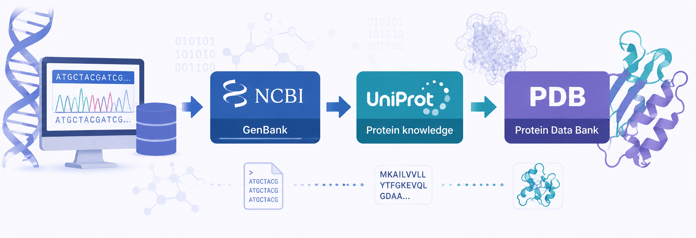

# Bloque I. Gestión de información biológica y recursos bioinformáticos

La Bioinformática moderna se apoya en una extensa infraestructura digital formada por bases de datos, repositorios científicos y recursos computacionales que permiten almacenar, organizar y compartir información biológica a escala global. Cada día, miles de investigadores generan nuevas secuencias, anotaciones funcionales y estructuras moleculares que son incorporadas a estos recursos, convirtiéndolos en una pieza fundamental para el avance de la Biología y la Biotecnología.

En este contexto, una de las competencias esenciales de cualquier profesional de la Biotecnología consiste en ser capaz de localizar, recuperar, interpretar y gestionar información biológica procedente de fuentes especializadas. La disponibilidad de grandes volúmenes de datos ha transformado la forma de investigar, haciendo necesario el uso de herramientas bioinformáticas que permitan acceder de manera eficiente a la información relevante para cada problema científico.

Este bloque introduce los fundamentos de la Bioinformática como disciplina y presenta el ecosistema digital que sustenta gran parte de la investigación biológica actual. A lo largo de sus contenidos se estudiarán los principales recursos bioinformáticos internacionales, las bases de datos biológicas más utilizadas y los formatos estándar empleados para representar y compartir información biológica.

---

## Objetivos de teoría

Al finalizar este bloque el estudiante será capaz de:

* Comprender el papel de la Bioinformática en la gestión de información biológica.
* Identificar las principales infraestructuras y recursos bioinformáticos utilizados en investigación.
* Diferenciar entre bases de datos biológicas primarias y secundarias.
* Interpretar los formatos estándar utilizados para representar secuencias y estructuras biológicas.
* Comprender la importancia de la calidad, interoperabilidad y reutilización de los datos biológicos.

---

## Objetivos de prácticas en aula

Al finalizar este bloque el estudiante será capaz de:

* Analizar registros biológicos procedentes de diferentes bases de datos.
* Evaluar la procedencia y fiabilidad de la información biológica recuperada.
* Seleccionar los recursos bioinformáticos más adecuados para responder a preguntas biológicas concretas.
* Interpretar la información contenida en registros de secuencias y estructuras biomoleculares.
* Utilizar literatura científica y recursos documentales especializados relacionados con la Bioinformática.

---

## Objetivos de prácticas de laboratorio

Al finalizar este bloque el estudiante será capaz de:

* Utilizar recursos bioinformáticos de referencia para la búsqueda de información biológica.
* Recuperar secuencias, anotaciones y estructuras biomoleculares desde bases de datos especializadas.
* Gestionar información biológica procedente de diferentes fuentes.
* Trabajar con formatos estándar utilizados en Bioinformática.
* Organizar y documentar conjuntos de datos biológicos para su posterior análisis.

---

## Aplicaciones en Biotecnología

Las competencias desarrolladas en este bloque constituyen la base de numerosos procesos de investigación y desarrollo en Biotecnología. La identificación de genes de interés, la búsqueda de proteínas con funciones específicas, el análisis de organismos modelo o la consulta de estructuras biomoleculares dependen del uso eficiente de bases de datos y recursos bioinformáticos.

La capacidad para acceder, interpretar y gestionar información biológica es actualmente una habilidad esencial en ámbitos como la genómica, la biotecnología industrial, la biomedicina, la farmacología y la investigación básica, donde el volumen de datos disponibles continúa creciendo de forma exponencial.

