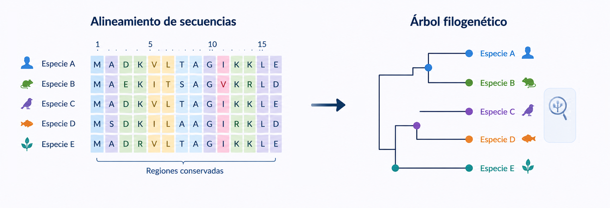

# Bloque II. Métodos computacionales para el análisis de secuencias

Las secuencias biológicas constituyen una de las principales fuentes de información en Biología y Biotecnología. El desarrollo de tecnologías de secuenciación ha permitido generar cantidades masivas de datos de ADN, ARN y proteínas, haciendo necesario el uso de herramientas computacionales capaces de analizarlos e interpretarlos de manera eficiente.

La comparación de secuencias es una de las tareas fundamentales de la Bioinformática. A través de ella es posible identificar genes y proteínas relacionados, inferir funciones biológicas, estudiar procesos evolutivos y establecer relaciones entre organismos. Para ello se utilizan algoritmos especializados capaces de comparar millones de secuencias almacenadas en bases de datos distribuidas por todo el mundo.

En este bloque se estudiarán los principales métodos computacionales utilizados para el análisis de secuencias biológicas, incluyendo técnicas de alineamiento, búsqueda por similitud y análisis filogenético. Estas herramientas constituyen la base de numerosas aplicaciones en investigación biomédica, genética, microbiología y Biotecnología.

---

## Objetivos de teoría

Al finalizar este bloque el estudiante será capaz de:

* Comprender los fundamentos computacionales de la comparación de secuencias biológicas.
* Diferenciar los conceptos de similitud, identidad y homología.
* Comprender el funcionamiento de los algoritmos de alineamiento local y global.
* Interpretar los resultados obtenidos mediante herramientas de búsqueda por similitud.
* Comprender los principios básicos del análisis filogenético asistido por ordenador.

---

## Objetivos de prácticas en aula

Al finalizar este bloque el estudiante será capaz de:

* Analizar alineamientos de secuencias biológicas.
* Interpretar métricas de calidad y significancia en búsquedas bioinformáticas.
* Comparar diferentes resultados obtenidos mediante herramientas de alineamiento.
* Evaluar relaciones funcionales y evolutivas a partir de secuencias biológicas.
* Resolver casos prácticos basados en datos reales.

---

## Objetivos de prácticas de laboratorio

Al finalizar este bloque el estudiante será capaz de:

* Utilizar herramientas bioinformáticas para el análisis de secuencias.
* Realizar búsquedas mediante BLAST y herramientas similares.
* Construir alineamientos múltiples.
* Generar e interpretar árboles filogenéticos básicos.
* Documentar y reproducir análisis bioinformáticos de secuencias.

---

## Aplicaciones en Biotecnología

Las técnicas de análisis de secuencias se utilizan de forma habitual en la identificación de microorganismos, la caracterización de genes de interés biotecnológico, el estudio de enfermedades genéticas, la vigilancia epidemiológica y la investigación evolutiva. Estas herramientas permiten transformar secuencias biológicas en conocimiento útil para la investigación y el desarrollo de nuevas aplicaciones biotecnológicas.

