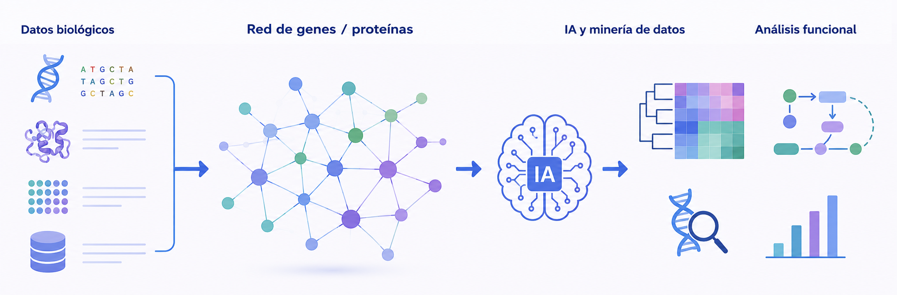

# Bloque III. Análisis funcional y minería de datos biológicos

La disponibilidad de grandes cantidades de información biológica ha desplazado parte del esfuerzo científico desde la generación de datos hacia su interpretación. Actualmente, uno de los principales retos de la Bioinformática consiste en transformar datos biológicos en conocimiento útil capaz de apoyar la investigación y la toma de decisiones.

La anotación funcional de genes y proteínas permite relacionar secuencias biológicas con funciones celulares, procesos metabólicos y mecanismos moleculares. Paralelamente, la integración de información procedente de múltiples fuentes facilita la construcción de una visión más completa de los sistemas biológicos estudiados.

Este bloque introduce los métodos y herramientas utilizados para la anotación funcional, la integración de datos biológicos y la exploración de grandes volúmenes de información. Además, se abordará el papel creciente de la automatización y de la inteligencia artificial en los flujos de trabajo bioinformáticos modernos.

---

## Objetivos de teoría

Al finalizar este bloque el estudiante será capaz de:

* Comprender los principios de la anotación funcional de genes y proteínas.
* Identificar las principales fuentes de información funcional utilizadas en Bioinformática.
* Comprender el papel de las ontologías biológicas y las bases de conocimiento.
* Analizar estrategias de integración de datos biológicos.
* Comprender las posibilidades y limitaciones de la inteligencia artificial aplicada a la Bioinformática.

---

## Objetivos de prácticas en aula

Al finalizar este bloque el estudiante será capaz de:

* Interpretar resultados de anotación funcional.
* Analizar casos de estudio basados en datos biológicos reales.
* Evaluar información procedente de diferentes recursos bioinformáticos.
* Interpretar resultados generados mediante herramientas de inteligencia artificial.
* Identificar buenas prácticas para garantizar la reproducibilidad de los análisis.

---

## Objetivos de prácticas de laboratorio

Al finalizar este bloque el estudiante será capaz de:

* Utilizar herramientas de anotación funcional.
* Integrar información procedente de múltiples recursos bioinformáticos.
* Explorar conjuntos de datos biológicos complejos.
* Automatizar tareas básicas de análisis bioinformático.
* Emplear herramientas de inteligencia artificial como apoyo a la interpretación de resultados.

---

## Aplicaciones en Biotecnología

La anotación funcional y la minería de datos biológicos desempeñan un papel esencial en la identificación de genes candidatos, el estudio de mecanismos moleculares, la búsqueda de biomarcadores, el descubrimiento de nuevas dianas terapéuticas y el análisis de grandes proyectos genómicos. Estas competencias son cada vez más relevantes en entornos de investigación y desarrollo basados en datos biológicos masivos.

