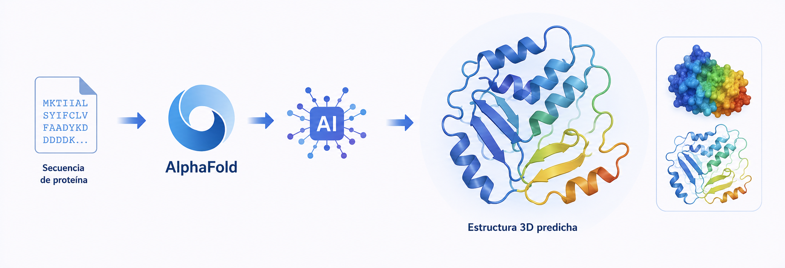

# Bloque IV. Bioinformática estructural y modelado computacional

La estructura tridimensional de las biomoléculas constituye uno de los niveles de información más importantes para comprender los procesos biológicos. La forma que adopta una proteína, un ácido nucleico o un complejo molecular determina en gran medida su función, sus interacciones y su comportamiento dentro de la célula. Por este motivo, el análisis estructural se ha convertido en una herramienta fundamental en ámbitos como la biomedicina, la farmacología y la Biotecnología.

Durante las últimas décadas se han desarrollado numerosas bases de datos y herramientas computacionales que permiten almacenar, visualizar y analizar estructuras biomoleculares con un nivel de detalle sin precedentes. Más recientemente, la aplicación de técnicas de inteligencia artificial ha transformado este campo, permitiendo predecir estructuras proteicas con una precisión que hasta hace pocos años parecía inalcanzable.

Este bloque introduce los principales recursos y herramientas utilizados en Bioinformática estructural. Se estudiarán los métodos de representación digital de biomoléculas, las técnicas de visualización molecular y las estrategias actuales de modelado y predicción estructural. Asimismo, se analizará el impacto de la inteligencia artificial en este ámbito y sus aplicaciones en investigación biomédica y Biotecnología.

---

## Objetivos de teoría

Al finalizar este bloque el estudiante será capaz de:

* Comprender la relación entre estructura y función en biomoléculas.
* Identificar los principales recursos computacionales utilizados en Bioinformática estructural.
* Comprender los fundamentos de la representación digital de estructuras biomoleculares.
* Analizar los principios básicos del modelado estructural computacional.
* Comprender el funcionamiento y las aplicaciones de las herramientas modernas de predicción estructural basadas en inteligencia artificial.

---

## Objetivos de prácticas en aula

Al finalizar este bloque el estudiante será capaz de:

* Interpretar información procedente de bases de datos estructurales.
* Analizar estructuras biomoleculares y relacionarlas con su función biológica.
* Evaluar aplicaciones biotecnológicas y biomédicas basadas en el conocimiento estructural.
* Interpretar resultados obtenidos mediante herramientas de modelado y predicción estructural.
* Analizar casos de estudio relacionados con el uso de inteligencia artificial en Bioinformática estructural.

---

## Objetivos de prácticas de laboratorio

Al finalizar este bloque el estudiante será capaz de:

* Utilizar recursos bioinformáticos para la consulta de estructuras biomoleculares.
* Visualizar y analizar estructuras tridimensionales mediante herramientas especializadas.
* Identificar elementos estructurales relevantes en proteínas y otras biomoléculas.
* Explorar modelos estructurales obtenidos mediante técnicas computacionales.
* Utilizar plataformas de predicción estructural basadas en inteligencia artificial.

---

## Aplicaciones en Biotecnología

La Bioinformática estructural desempeña un papel fundamental en el diseño racional de fármacos, la ingeniería de proteínas, la identificación de dianas terapéuticas, el estudio de enfermedades de origen molecular y el desarrollo de nuevas aplicaciones biotecnológicas. La capacidad para analizar e interpretar estructuras biomoleculares permite comprender mejor los mecanismos biológicos y acelerar procesos de investigación que tradicionalmente requerían largos periodos de trabajo experimental.

La aparición de herramientas basadas en inteligencia artificial, como los sistemas de predicción estructural de proteínas, ha impulsado una nueva etapa en la investigación biomolecular. Estas tecnologías están transformando la forma en que se estudian las biomoléculas y abren nuevas oportunidades para la innovación en Biotecnología, Biomedicina y Ciencias de la Vida.
