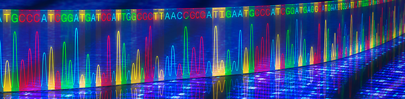

# Contenidos

**Bioinformática (BIO)** se organiza en cuatro bloques temáticos que se desarrollan de forma progresiva a lo largo del semestre. Aunque cada bloque aborda un conjunto específico de herramientas y metodologías, todos ellos están estrechamente relacionados y persiguen un objetivo común: capacitar al estudiante para gestionar, analizar e interpretar información biológica mediante recursos computacionales. Esta estructura permite adquirir una visión integrada de la Bioinformática como disciplina tecnológica al servicio de la investigación biológica y la Biotecnología.

**BLOQUE I. Gestión de información biológica y recursos bioinformáticos** introduce los fundamentos de la Bioinformática y el ecosistema digital que sustenta la investigación biológica moderna. Se estudian las principales bases de datos biológicas, los recursos bioinformáticos de referencia y los formatos utilizados para representar y compartir información biológica. Este bloque proporciona las competencias necesarias para localizar, recuperar, organizar y gestionar datos biológicos de forma eficiente.

**BLOQUE II. Métodos computacionales para el análisis de secuencias** aborda las técnicas utilizadas para comparar y analizar secuencias biológicas mediante herramientas bioinformáticas. Se estudian los fundamentos del alineamiento de secuencias, la búsqueda por similitud en grandes bases de datos y los métodos computacionales empleados en el análisis filogenético. El bloque proporciona una base sólida para interpretar relaciones funcionales y evolutivas a partir de datos moleculares.

**BLOQUE III. Análisis funcional y minería de datos biológicos** se centra en la extracción de conocimiento a partir de datos biológicos. Se estudian los procesos de anotación funcional de genes y proteínas, la integración de información procedente de diferentes fuentes y el uso de herramientas computacionales para la exploración y análisis de datos biológicos. Asimismo, se introducen técnicas de automatización e inteligencia artificial aplicadas a la Bioinformática, cada vez más presentes en los entornos de investigación y desarrollo biotecnológico.

**BLOQUE IV. Bioinformática estructural y modelado computacional** explora los recursos y herramientas utilizados para el estudio de estructuras biomoleculares. Se analizan las principales bases de datos estructurales, las técnicas de visualización molecular y los métodos de modelado y predicción estructural. El bloque incorpora además las aplicaciones recientes de la inteligencia artificial en la predicción de estructuras proteicas, proporcionando una visión actual de uno de los ámbitos con mayor crecimiento dentro de la Bioinformática.