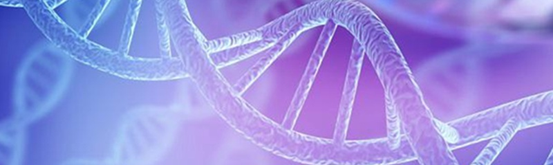

# Bioinformática

<h1 style="text-align: center;">Bienvenido a Bioinformática</h1>

## 📱 Bioinformática

**Bioinformática** es una asignatura obligatoria de 2.º curso del Grado en Biotecnología. Su objetivo es capacitar al alumnado en el uso de herramientas computacionales para la gestión, análisis e interpretación de información biológica. A lo largo de la asignatura se abordan aspectos como la utilización de bases de datos biológicas, el análisis de secuencias, la anotación funcional de genes y proteínas, así como la visualización y predicción de estructuras biomoleculares mediante recursos bioinformáticos especializados.

La materia proporciona una formación tecnológica complementaria a los conocimientos biológicos adquiridos previamente por el estudiantado, introduciendo metodologías y herramientas esenciales para el trabajo con datos biológicos. Asimismo, incorpora el uso de recursos computacionales modernos, técnicas de automatización e inteligencia artificial aplicadas a la Bioinformática, contribuyendo al desarrollo de competencias cada vez más demandadas en ámbitos como la investigación biomédica, la biotecnología, la genómica, la farmacología y las ciencias de la vida en general.

**Profesorado:**

- José Carlos Rodríguez Rodríguez. Responsable de prácticas  
  
- María Dolores Afonso Suárez. Coordinadora 

**© María Dolores Afonso Suárez.** Contenidos bajo licencia [CC BY-NC-SA 4.0](https://creativecommons.org/licenses/by-nc-sa/4.0/deed.es): se permite su uso y adaptación con atribución, sin fines comerciales y manteniendo la misma licencia.
